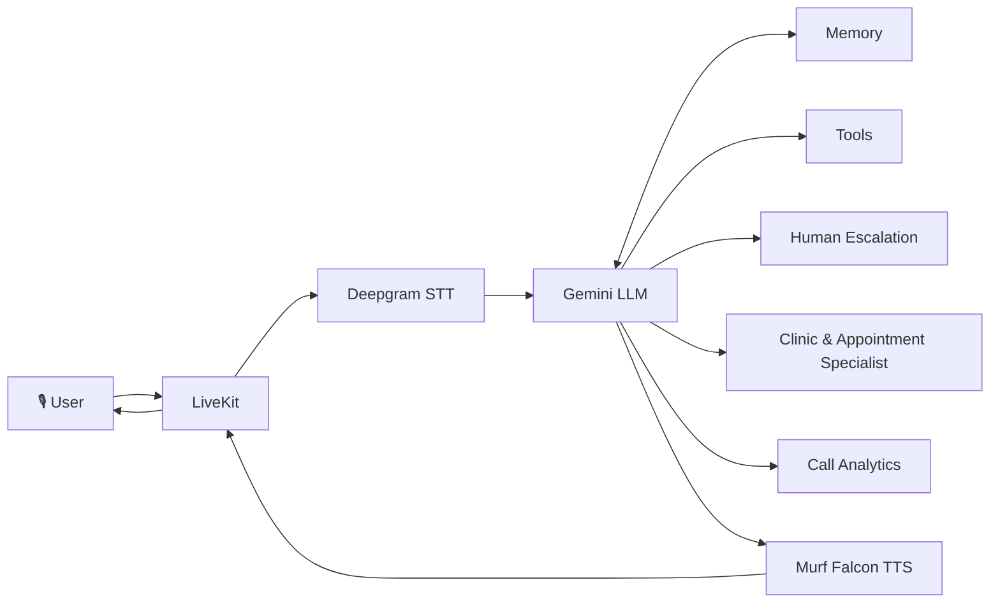

# Care Voice

Care Voice is a voice-based healthcare assistant built for the **10 Days of Voice Agents: VoiceForBharat Edition**.

It helps users interact with healthcare services through natural voice conversations, including symptom triage, human escalation, appointment assistance, call analytics, and specialist agent handoff.

Built with **Murf Falcon, Deepgram, Gemini, LiveKit, FastAPI, Python, Next.js, and TypeScript**.

[](https://opensource.org/licenses/MIT) [](https://murf.ai/api/docs/text-to-speech/streaming) [](https://docs.livekit.io) [](https://www.typescriptlang.org/) [](https://www.python.org/)

---

## Features

- Voice-based healthcare assistance
- Indian language conversations
- Symptom triage using a rule-based tool
- Safety guardrails
- Memory for returning users
- Human escalation with confirmation IDs
- Outbound voice calling
- Call Analytics Dashboard
- Clinic & Appointment Specialist handoff
- Real-time voice responses powered by Murf Falcon

---

## Architecture




---
## Quickstart

### Prerequisites

- **Python** 3.10+
- **[uv](https://docs.astral.sh/uv/)** - fast Python package manager
  ```bash
  # macOS/Linux
  curl -LsSf https://astral.sh/uv/install.sh | sh
  # Windows (PowerShell)
  powershell -ExecutionPolicy ByPass -c "irm https://astral.sh/uv/install.ps1 | iex"
  ```
- **Node.js** 18+
- **pnpm** — fast Node package manager
  ```bash
  npm install -g pnpm
  ```
- A [LiveKit](https://cloud.livekit.io/) project (free tier available)

### Step 1: Clone the repo

```bash
git clone https://github.com/bhuvanahj/Care-Voice.git
cd Care-Voice
```

### Step 2: Set up environment variables

Create `.env.local` in both `backend/` and `frontend/` (copy from `.env.example` in each). You need:

| Variable | Where to get it | Required |
|----------|-----------------|----------|
| `LIVEKIT_URL` | LiveKit Cloud dashboard | Yes |
| `LIVEKIT_API_KEY` | LiveKit Cloud dashboard | Yes |
| `LIVEKIT_API_SECRET` | LiveKit Cloud dashboard | Yes |
| `MURF_API_KEY` | [murf.ai/api/dashboard](https://murf.ai/api/dashboard) | Yes |
| `DEEPGRAM_API_KEY` | [deepgram.com](https://deepgram.com) | Yes |
| `GOOGLE_API_KEY` (or `OPENAI_API_KEY`) | Depends on LLM choice | Yes |

### Step 3: Install backend dependencies

```bash
cd backend
uv sync
```

### Step 4: Install frontend dependencies

```bash
cd frontend
pnpm install
```

### Step 5: Run it

**Option A - All-in-one (from repo root):**

```bash
# macOS/Linux
chmod +x start_app.sh
./start_app.sh

# Windows (PowerShell)
.\start_app.ps1
```

**Option B - Separate terminals:**

```bash
# Terminal 1 — LiveKit Server
livekit-server --dev

# Terminal 2 — Backend agent
cd backend && uv run python src/agent.py dev

# Terminal 3 — Frontend
cd frontend && pnpm dev
```

Then open **http://localhost:3000** in your browser.

You should now see the voice agent UI. Click **Start talking**, allow microphone access, and speak — the agent will respond with Murf Falcon TTS. Ensure your backend and (if using Option B) LiveKit server are running.

---

## Configuration

### Murf voice

Edit the `tts=murf.TTS(...)` call in `backend/src/agent.py`. Set the `voice` argument to any Murf voice ID. Examples:

- `en-US-natalie` — US English (female)
- `en-UK-ruby` — UK English (female)
- `en-US-miles` — US English (male)
- `en-US-matthew` — US English (male)

Browse all voices: [Murf Voice Library](https://murf.ai/api/docs/voices-styles/voice-library).

### STT provider

STT is configured in `backend/src/agent.py` in the `AgentSession(stt=...)` call. The default is Deepgram (`deepgram.STT(model="nova-3")`). You can swap to another LiveKit-compatible STT plugin if needed.

### LLM (Gemini vs OpenAI)

- **Gemini (default):** Set `GOOGLE_API_KEY` and use `llm=google.LLM(model="gemini-2.5-flash")` in `agent.py`.
- **OpenAI:** Set `OPENAI_API_KEY`, add the OpenAI plugin, and use the corresponding `llm=openai.LLM(...)` in `agent.py`.

### Audio format

Murf Falcon and LiveKit handle audio format internally. For advanced options, see [Murf API docs](https://murf.ai/api/docs) and [LiveKit docs](https://docs.livekit.io).

---

## Project Structure

```text
Care-Voice/
├── backend/                         # Python voice agent backend
│   ├── src/                         # Agent logic and backend modules
│   ├── tests/                       # Backend tests
│   ├── KMS/                         # Key management / project resources
│   ├── calls.json                   # Call records
│   ├── escalations.json             # Escalation records
│   ├── .env.example                 # Backend environment template
│   ├── pyproject.toml               # Python dependencies
│   ├── Dockerfile                   # Backend container configuration
│   ├── railway.toml                 # Railway configuration
│   └── README.md                    # Backend documentation
│
├── frontend/                        # Next.js + TypeScript voice interface
│   ├── app/                         # Next.js application
│   ├── components/                  # UI components
│   ├── hooks/                       # React hooks
│   ├── lib/                         # Frontend utilities
│   ├── public/                      # Static assets
│   ├── styles/                      # Global styles
│   ├── dashboard.html               # Call analytics dashboard
│   ├── app-config.ts                # Frontend configuration
│   ├── package.json                 # Node dependencies
│   ├── .env.example                 # Frontend environment template
│   └── README.md                    # Frontend documentation
│
├── start_app.ps1                    # Windows startup script
├── start_app.sh                     # macOS/Linux startup script
├── README.md                        # Project documentation
└── AGENTS.md                        # Development guidance
```

For deeper documentation on each part, see:

- [Backend Documentation](./backend/README.md) — agent pipeline, voice/LLM/STT configuration, testing, deployment
- [Frontend Documentation](./frontend/README.md) — UI customization, visualizers, theming, component architecture

---

## Links

- [Murf API Docs](https://murf.ai/api/docs)
- [Murf Voice Library](https://murf.ai/api/docs/voices-styles/voice-library)
- [LiveKit Docs](https://docs.livekit.io)
- [Deepgram Docs](https://developers.deepgram.com)
- [Murf Falcon Benchmarks](https://murf.ai/falcon/benchmarks)
- [TTS Latency Benchmarker](https://github.com/sahilsgupta/tts-latency-benchmarker) — run your own p50/p95 tests across providers
- [Murf Discord](https://discord.gg/FbKAy96Sz7)
- [Murf Startup Incubator](https://murf.ai/api) — 50M free characters for startups

---

## License

MIT
